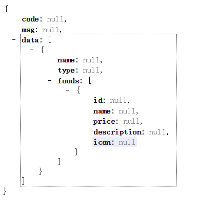

# 微信点餐系统
🍜微信点餐系统，前后端分离，简单的基于springboot以及前后端分离的一个练手项目。

### 1.项目概述

以Spring Boot和微信特性为核心技术栈，实现一个从下单到接单流程完整，包含买家端和卖家端前后台功能的微信点餐系统，带你一步步设计并开发一个中小型企业级Java应用。

### 2.数据库设计

#### 2.1商品表

```sql
-- 商品表
create table `product_info`(
    `product_id` varchar (32) not null,
    `product_name` varchar (64) not null comment '商品名称',
    `product_price` decimal(8,2) not null  comment '单价',
    `product_stock` int not null comment '库存',
    `product_description` varchar (64) comment '描述',
    `product_status` tinyint(3) default '0' comment '状态,0正常1下架',
    `product_icon` varchar (512) comment '小图',
    `category_type` int not null comment '类目编号',
    `create_time` timestamp  not null default current_timestamp  comment '创建时间',
    `update_time` timestamp not null default current_timestamp  on update current_timestamp comment '修改时间',
    primary key (`product_id`)
) comment '商品表';
```

#### 2.2类目表

```sql
-- 类目表
create table `product_category`(
    `category_id` int not  null auto_increment,
    `category_name` varchar (64) not null comment '类目名字',
    `category_type` int not null comment '类目编号',
    `create_time` timestamp  not null default current_timestamp  comment '创建时间',
    `update_time` timestamp not null default current_timestamp  on update current_timestamp comment '修改时间',
    primary key (`category_id`),
    unique key `uqe_category_type` (`category_type`)
) comment '类目表';
```

#### 2.3订单表

```sql
-- 订单表
create table `oeder_master`(
    `order_id` varchar (32) not null,
    `buyer_name` varchar (32) not null comment '买家名字',
    `buyer_phone` varchar (32) not null comment '买家电话',
    `buyer_address` varchar (128) not null comment '买家地址',
    `buyer_openid` varchar (64) not null comment '买家openid',
    `order_amount` decimal (8,2) not null comment '订单金额',
    `order_status` tinyint(3) not null default '0' comment '订单状态，默认0新下单',
    `pay_status` tinyint(3) not null default '0' comment '支付状态，默认0未支付',
    `create_time` timestamp  not null default current_timestamp  comment '创建时间',
    `update_time` timestamp not null default current_timestamp  on update current_timestamp comment '修改时间',
    primary key(`order_id`),
    key `idx_buyer_openid` (`buyer_openid`)
) comment '订单表';
```

#### 2.4订单详情

```sql
-- 订单详情
create table `order_detail`(
    `detail_id` varchar (32) not null,
    `order_id` varchar (32) not null,
    `product_id` varchar (32) not null,
    `product_name` varchar (64) not null comment '商品名称',
    `product_price` decimal (8,2) not null comment'商品价格',
    `product_quantity` int not null comment '商品数量',
    `product_icon` varchar (512) comment '商品图片',
    `create_time` timestamp  not null default current_timestamp  comment '创建时间',
    `update_time` timestamp not null default current_timestamp  on update current_timestamp comment '修改时间',
    primary key(`detail_id`),
    key `idx_order_id` (`order_id`)
) comment '订单详情表';
```
### 3.项目开发
* 开发思路：尽量得抽离
* 流程：pojo->dao->单元测试->service->单元测试->controller
#### 3.1 插件
* lombk插件
* 添加依赖：

<!--getset方法工具-->
           <dependency>
               <groupId>org.projectlombok</groupId>
               <artifactId>lombok</artifactId>
           </dependency>
          
          
* Chrome开发插件JsonView可以将Json数据格式化
* 效果展示：

    


说明：开发项目是学习的一个过程，由此将开发过程中遇到的细节性问题以及，平时掌握不牢固的东西总结至[problem.md](problem.md),为自己提个醒。